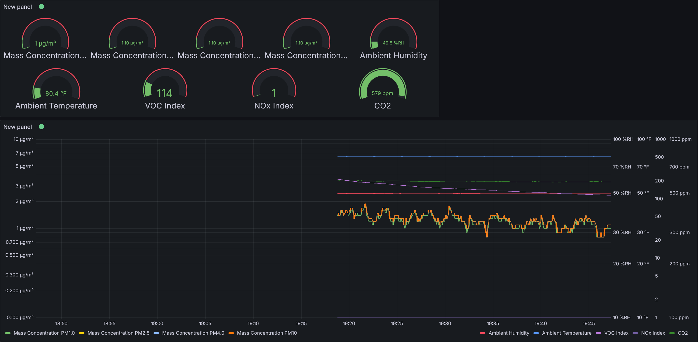

# Air Quality Sensors<a name="Air Quality Sensors"></a>

Utilizes the SEN55 and SCD40 sensors to monitor the quality of the air allowing the user to track their air quality over-time.
This can run on any embedded device that allows for multi-threading and has an I2C Bus.<br>

## Requirements
This requires Eclipse Paho for the MQTT publisher, this can be built like so:
```bash
git clone https://github.com/eclipse-paho/paho.mqtt.c.git
cd org.eclipse.paho.mqtt.c.git
make
```
And to install type:
```bash
sudo make install
```
Another requirement is cJSON which can be built like so:
```bash
git clone https://github.com/DaveGamble/cJSON.git
cd cJSON
mkdir build
cd build
cmake ..
```
And to install type:
```bash
sudo make install
```

## Building
Firstly, you are going to want to go into the address.h file in the include directory and change it to the address of your MQTT server. After you've done that go back to the main directory and run the following commands:
```bash
mkdir build
cd build
cmake .. -DCMAKE_BUILD_TYPE=[Debug/Launch]
make
```
Finally, to run the program run the following commands:
```bash
cd bin
./publisher
```

## Features
This project allows you to monitor the Mass Concentration PM(1.0, 2.5, 4.0, 10), Ambient Humidity, Ambient Temperature, VOC and NOx indecies, and the CO2 concentration. The data is read from the sensor every five seconds, which can be changed by changing the WAIT_TIME constant in the publisher.c file.<br>
To stop the program, simply press CTRL + C or type:
```bash
killall -2 publisher
```
 This will notify the program the clean up and safely close down. Failure to do this or using:
 ```bash
 killall -9 publisher
```
will cause the sensors to not stop measurements which WILL cause issues when restarting the program.

### Images
Using a visualizer like Grafana in conjunction with Mosquitto, you can expect the data to look similar to this: <br>\

